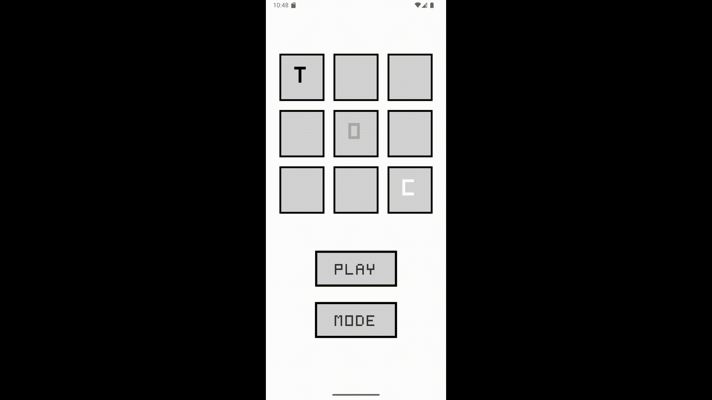

# **Toc - A Modern Tic-Tac-Toe App**

Toc is a simple and fun Tic-Tac-Toe game for Android. The game features a home and game page, different modes (light or dark), and a smooth flashing animation to highlight the winning pattern.

## **How to Play**
- 🏆 Players take turns marking a square with their assigned colour (red or blue) on the grid.  
- 🎯 The first player to align three marks in a row, column, or diagonal wins.  
- 🔄 If all squares are filled without a winner, the game ends in a draw.
  
## **Features**
- 🎨 **Different Modes** – Choose between different modes to match your visual preferences.
- 🤖 **Multiplayer Mode** – Share a phone with a friend and play against them.  
- 🔥 **Smooth Animations** – Witness smooth winning animations.  

## **Gameplay Preview**

## **Code Structure**
The codebase was modularized to improve readability and maintainability. Classes include:  

- **`GameActivity.java`** – Handles the game logic and UI.  
- **`HomeActivity.java`** – Handles navigation and settings.  
- **`Animation.java`** – Handles animations and visual effects.  
- **`EventListener.java`** – Handles button interactions.  
- **`Theme.java`** – Handles theme switching using day/night XML files.
- **`Grid.java`** – Handles the Tic-Tac-Toe grid logic.  
- **`Turn.java`** – Handles player turns.  

## **Installation**
1. Clone the repository
2. Open the project in Android Studio.
3. Build and run the app on an emulator or physical device using a USB cable.

### *Planned*, *Designed*, *Implemented*, *Tested*, and *Forgotten About* by Timi Aina
